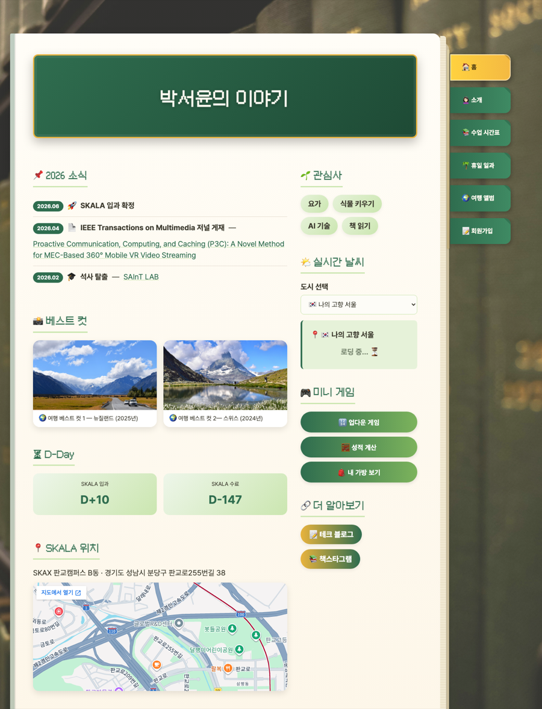
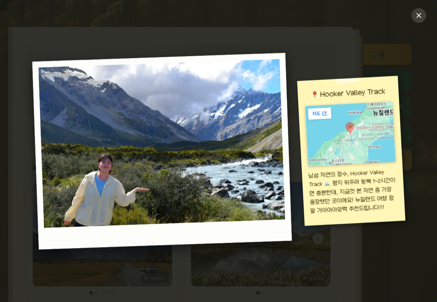
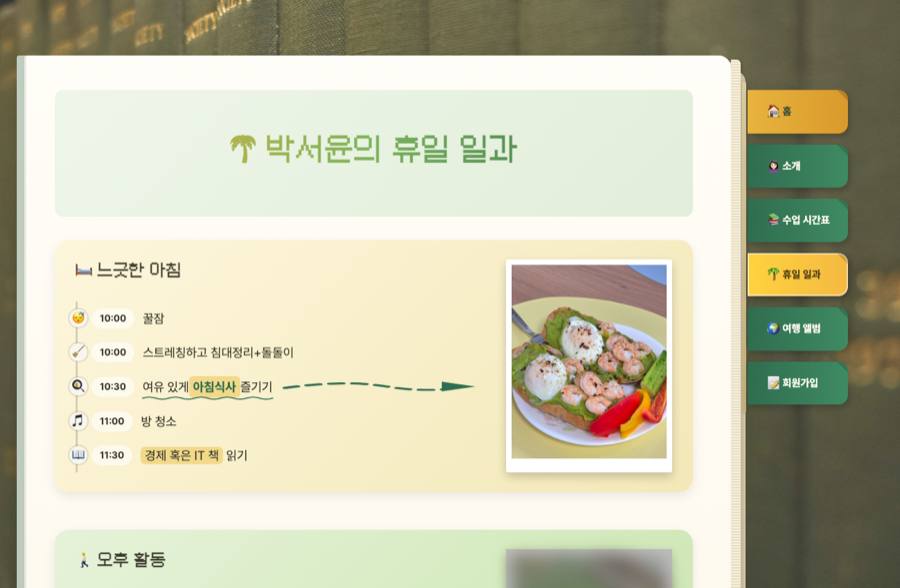
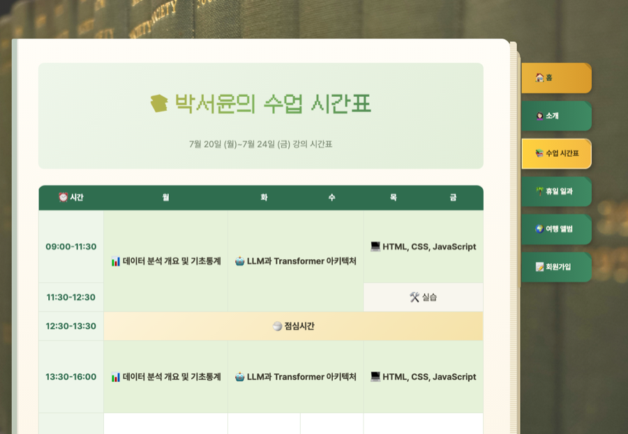
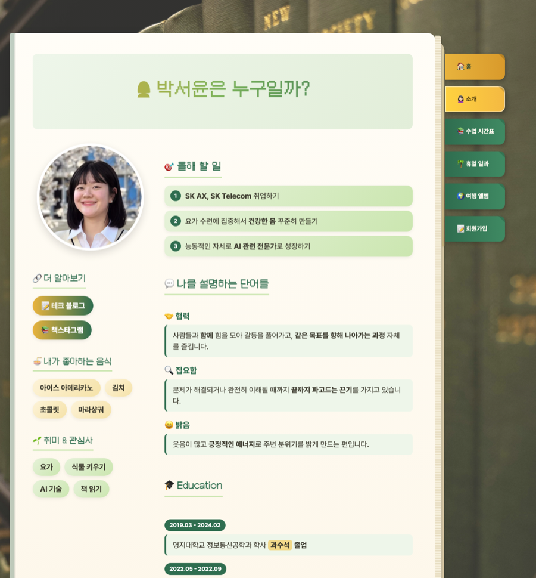
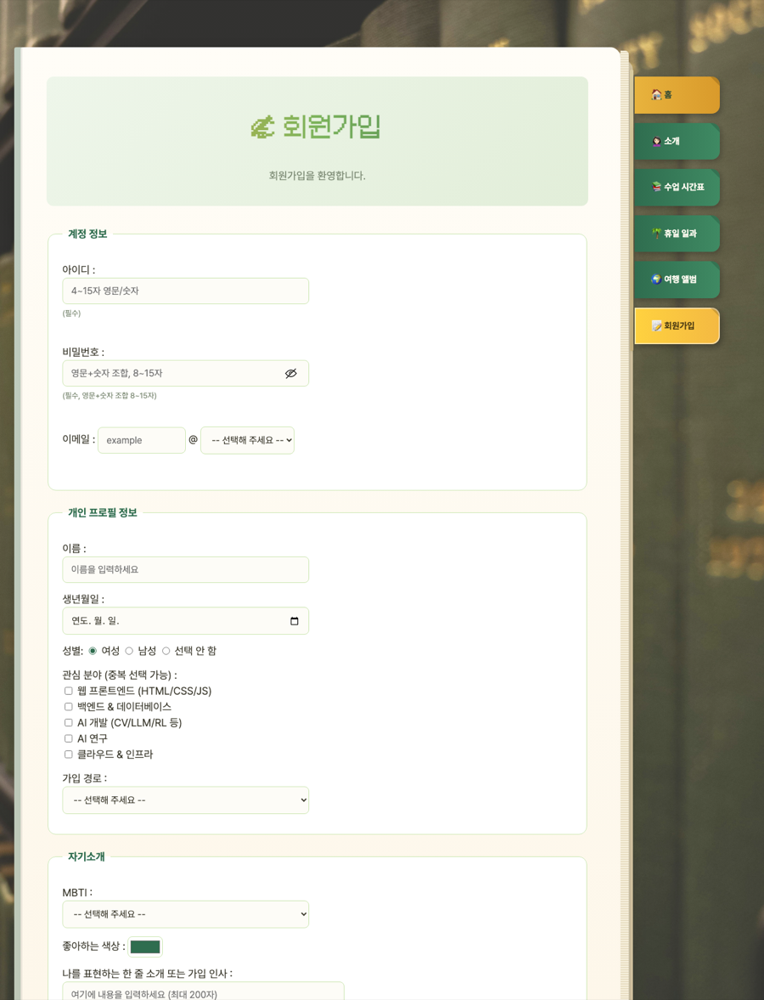

# 📖 SKALA-FRONT


## 💻 프로젝트 소개

이 프로젝트는 SK그룹 SW·AI 인재 양성 과정 **SKALA 4기**의 프론트엔드 기초 실습 과제입니다. "나만의 개인 페이지 만들기"를 주제로, 프레임워크 없이 **시맨틱 HTML + 반응형 CSS + 바닐라 JavaScript**만으로 멀티 페이지 웹사이트를 직접 설계하고 구현했습니다.

이 과제를 통해 다음을 익힐 수 있었습니다.

- 🏷️ `nav` · `main` · `aside` · `table` · `form` 등 시맨틱 태그로 문서 구조 설계하기
- 📱 미디어 쿼리를 활용한 반응형 레이아웃 구성
- 🖱️ DOM 이벤트와 `prompt`/`alert` 기반의 사용자 인터랙션 구현
- 🌐 `fetch` + `async/await`로 외부 API를 비동기 호출하고 화면에 렌더링하기
- 📦 ES 모듈(`import`/`export`)로 역할에 따라 JavaScript 파일 분리하기

<br>

## 📸 미리보기

|                            홈 (메인 허브)                            |                       여행 앨범 — 포스트잇 라이트박스                       |
| :--------------------------------------------------------------: | :------------------------------------------------------------------: |
|                          |                    |

|                        휴일 일과 — 클릭해서 사진 공개                        |                            수업 시간표                            |
| :------------------------------------------------------------------: | :------------------------------------------------------------: |
|  |  |

|                          소개 페이지                          |                            회원가입 폼                            |
| :--------------------------------------------------------: | :------------------------------------------------------------: |
|        |  |

<br>

## ✨ 주요 기능

| 기능 | 설명 | 관련 파일 |
| --- | --- | --- |
| 🌤️ **실시간 날씨** | 도시를 선택하면 Open-Meteo API를 `fetch` + `async/await`로 호출해 현재 날씨·기온·습도를 표시 | `script/weatherAPI.js`<br>`script/realtimeInfo.js` |
| 🖼️ **여행 앨범** | 여행지별 사진 캐러셀 + 클릭하면 뜨는 포스트잇 스타일 라이트박스(위치 지도, 후기) | `html/myTrip.html` |
| 🌴 **휴일 일과 리빌** | 타임라인 항목을 클릭하면 손글씨 밑줄과 함께 폴라로이드 사진이 공개되는 인터랙션 | `html/myHoliday.html` |
| 📝 **회원가입 실시간 검증** | 아이디/비밀번호/이메일 입력값을 즉시 검사하고, 비밀번호 표시 토글 제공 | `script/form-validation.js` |
| 🎮 **미니 게임** | 업다운 숫자 맞추기, 성적 계산기, 가방 속 물건 보기 | `script/upDown.js`<br>`script/grade.js`<br>`script/bag.js` |
| ⏳ **D-Day 계산** | SKALA 입과·수료일까지 남은 일수를 자동 계산 | `script/dday.js` |
| 📖 **페이지 전환 애니메이션** | 메뉴 이동 시 책장이 넘어가는 듯한 오버레이 연출 | `script/pageTransition.js` |

<br>

## 🗂️ 페이지 구성

| 페이지        | 경로                                                   | 설명                                             |
| ---------- | ----------------------------------------------------- | ------------------------------------------------ |
| 🏠 홈        | `html/index.html`                                      | 소식, 베스트 컷, D-Day, 실시간 날씨, 미니 게임을 모아둔 메인 허브 |
| 🙍🏻‍♀️ 소개     | `html/myProfile.html`                                  | 좋아하는 음식, 올해 할 일, 나를 설명하는 단어, 학력           |
| 📚 수업 시간표 | `html/myClass.html`                                    | 강의 시간표 표                                     |
| 🌴 휴일 일과   | `html/myHoliday.html`                                  | 하루 일과 타임라인 (클릭하면 사진 공개)                |
| 🌍 여행 앨범   | `html/myTrip.html`                                     | 여행지별 사진 캐러셀, 위치·후기가 담긴 메모지 라이트박스   |
| 📝 회원가입    | `html/signUp.html`, `html/signUpResult.html`           | 실시간 유효성 검사가 있는 회원가입 폼                  |

<br>

## 🛠️ 기술 스택

- **HTML5 / CSS3**: 프레임워크 없이 시맨틱 태그와 미디어 쿼리로 작성한 반응형 레이아웃
- **Vanilla JavaScript (ES Modules)**: `weatherAPI.js` ↔ `realtimeInfo.js`처럼 API 호출과 화면 렌더링 역할 분리
- **폰트**: Pretendard Variable, Mona12 / Mona12 Text KR (자체 호스팅)
- **Open-Meteo API**: 실시간 날씨 데이터

<br>

## 🚀 실행 방법

빌드 과정이나 패키지 설치 없이 바로 실행할 수 있습니다. 다만 실시간 날씨(`fetch`)와 JS 모듈(`type="module"`)을 쓰기 때문에, 파일 탐색기에서 `index.html`을 더블클릭해 `file://`로 여는 방식은 브라우저 보안 정책 때문에 정상 동작하지 않습니다. 아래 두 방법 중 하나로 **로컬 서버**를 통해 열어주세요.

### 0. 클론

```bash
git clone https://github.com/seoyun-dev/skala-front.git
cd skala-front
```

### 방법 A. VS Code Live Server (추천)

1. VS Code에서 `skala-front` 폴더를 엽니다.
2. 왼쪽 **확장(Extensions)** 탭에서 `Live Server`를 검색해 설치합니다. (이미 있다면 건너뜁니다)
3. 탐색기에서 `html/index.html`을 우클릭 → **Open with Live Server** 클릭
4. 브라우저가 자동으로 열리며 아래 주소로 접속됩니다.

   ```
   http://127.0.0.1:5500/html/index.html
   ```

### 방법 B. 터미널에서 로컬 서버 실행

```bash
# skala-front 폴더 안에서 실행
python3 -m http.server 8000
```

서버가 켜지면 브라우저에서 아래 주소로 접속합니다.

```
http://localhost:8000/html/index.html
```

서버를 끄고 싶으면 명령어를 실행한 터미널에서 `Ctrl + C`를 누르면 됩니다.

<br>

## 📁 폴더 구조

```
skala-front/
├── html/
│   ├── index.html            # 🏠 홈 — 메인 허브 (소식 · 베스트 컷 · D-Day · 실시간 날씨 · 미니 게임)
│   ├── myProfile.html        # 🙍🏻‍♀️ 소개 페이지
│   ├── myClass.html          # 📚 수업 시간표
│   ├── myHoliday.html        # 🌴 휴일 일과
│   ├── myTrip.html           # 🌍 여행 앨범
│   ├── signUp.html           # 📝 회원가입 폼
│   └── signUpResult.html     # ✅ 회원가입 완료 페이지
│
├── css/
│   ├── style.css             # 전체 페이지 공통 스타일 (레이아웃 · 반응형 · 애니메이션)
│   └── fonts/                # 자체 호스팅 폰트 (Mona12, Mona12-Bold, Mona12 Text KR)
│
├── script/
│   ├── dday.js               # D-Day 계산 (index.html)
│   ├── upDown.js             # 업다운 숫자 맞추기 게임
│   ├── grade.js              # 성적 계산기
│   ├── bag.js                # 가방 속 물건 보기
│   ├── weatherAPI.js         # Open-Meteo API 호출 함수 (export)
│   ├── realtimeInfo.js       # 날씨 위젯 렌더링 (weatherAPI.js를 import, type="module")
│   ├── form-validation.js    # 회원가입 폼 실시간 유효성 검사
│   └── pageTransition.js     # 페이지 이동 시 책장 넘김 애니메이션
│
├── media/                    # 이미지 · 오디오 · 비디오
│
└── docs/
    └── screenshots/          # README용 캡처 이미지
```
